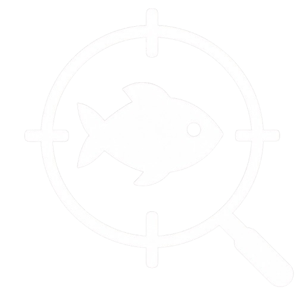

<div align="center">
   
   <h1>FishScope Macro</h1>
   <p><i>The most advanced Sols RNG Fishing Macro with Auto Sell and webhook statistics.</i></p>
   <p>
      
      
      
      
   </p>
</div>

---


## Installation

### Prerequisites
- Python 3.7 or higher
- Windows OS (uses AutoIt for mouse control)

### Setup
1. Clone or download this repository
2. Install dependencies:
   ```bash
   pip install -r requirements.txt
   ```
3. Run the application:
   ```bash
   python main.py
   ```


## Dependencies

- **PyQt6** (≥6.4.0): GUI framework
- **pyautogui** (≥0.9.54): Screen capture and mouse control
- **Pillow** (≥9.0.0): Image processing
- **keyboard** (≥0.13.5): Global hotkey support
- **autoit-py** (≥0.1.0): Windows macro support
- **requests** (≥2.25.0): HTTP requests for auto updater


## Usage

### Initial Setup
1. Launch with `python main.py`
2. Calibrate all coordinates using the GUI:
   - **Fish Button**: Click location to start fishing
   - **White Diamond**: Pixel that turns white when fish is caught
   - **Reel Bar**: Area containing the fishing progress bar
   - **Completed Border**: Pixel indicating minigame completion
   - **Close Button**: Button to close the success screen
   - **First Item**: Location of the first inventory item
   - **Sell Button**: Button to sell items
   - **Confirm Button**: Button to confirm sale
   - **Mouse Idle Position**: Safe area for mouse when not in use
   - **Shaded Area**: Location to sample dynamic shaded colors
3. Tutorial at: https://youtu.be/XgNnymJ-26E

### Running the Macro
- **Start**: Press F1 or click "Start Macro"
- **Stop**: Press F2 or click "Stop Macro"

### Updates
- **Automatic**: Checks for updates on startup
- **Manual**: Click "Check for Updates" in settings
- **Update Process**: Opens browser to download latest release from GitHub

### Configuration
Settings are saved to `fishscopeconfig.json` and include:
- All calibrated coordinates
- Current shaded color values


## Troubleshooting

### Common Issues
- **Calibration not working**: Ensure you're clicking the exact pixels/areas as described
- **Color detection failing**: Recalibrate the shaded area and white diamond locations
- **Mouse not moving**: Check that AutoIt is properly installed
- **Hotkeys not working**: Run as administrator if needed
- **Update check failing**: Check internet connection and firewall settings
- **Application not starting**: Ensure all dependencies are installed via pip

### Recalibration
Use the "Reset to Defaults" button to restore original coordinates, then recalibrate for your setup.

### Update Issues
- If auto-update check fails, manually visit the GitHub releases page
- Ensure internet connection is stable for update checking
- Updates require manual download and installation


## License

This project is licensed under the GNU Affero General Public License v3.0 (AGPL-3.0). See the [LICENSE](LICENSE) file for details.


## Credits

- **Created by**: cresqnt
- **Auto Sell Idea**: x2_c
- **Discord Support**: [.gg/6cuCu6ymkX](https://discord.gg/6cuCu6ymkX)
- <sub>Yes, I used Gemini to create parts of this readme.</sub>

---

<div align="center">
   <sub>© 2025 Scope Development. All rights reserved.</sub>
</div>
